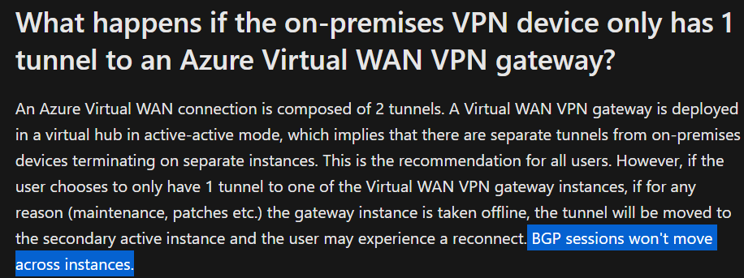

# Connecting a Cisco ASA to Azure Virtual WAN via IPsec VPN

It is possible to terminate S2S VPN's natively in Azure using either native VPN Gateways (that run inside a customer-managed VNet), or by using a Virtual WAN Hub that has the S2S function enabled.

An existing article highlights the pattern options for HA S2S VPN connectivity to native Azure VPN Gateways - https://learn.microsoft.com/en-us/azure/vpn-gateway/vpn-gateway-highlyavailable. This is good pre-reading before jumping in here.

I will borrow some diagrams from this article below.

## Context, why Virtual WAN (VWAN) is different for S2S VPN termination

Whenever we deploy a VPN termination function in Azure, it always comes with an element of HA/resilience under the covers. There are two nodes behind the scenes, and how, and where they operate depends on the logical config we choose.

### Resilience deployment options

With regular VPN Gateways we have the option of either Active/Standby nodes, or Active/Active nodes.

**Active/Standby**

With regular VPN Gateways, we have the option of running the underlying nodes in an A/S state, wherein we always connect our remote sites to the primary active node, via a single tunnel from each remote On-Premises public IP endpoint. The main benefit of this deployment type, is that if the Active node fails, both the tunnel endpoint PiP, as well as any BGP configuration fails over to the standby node.

> I.e. The On-Prem device/firewall can be configured with a single tunnel, and even if there is a failure in Azure, service will resume automatically after the standby nodes takes over. This is an important point in the context of Cisco ASA, as we will see later.

> NB. Azure Virtual WAN does not support Active/standby deployment type

**Active/Active**

With regular VPN Gateways we also have the option of running the underlying nodes A/A, wherein the remote On-Prem device builds multiple tunnels to Azure (to multiple PiPs). This has benefits in terms of failover flexibility and throughput. Azure Virtual WAN VPN function **always runs in active/active mode**.

However, this A/A design comes with one large consideration that is implied by the diagram, your On-Prem device must build multiple tunnels that are always active, and again this has impact on our Cisco ASA design when using BGP as we will talk about later.

Spoiler, pay attention to [this](https://learn.microsoft.com/en-us/azure/virtual-wan/virtual-wan-faq#what-happens-if-the-on-premises-vpn-device-only-has-1-tunnel-to-an-azure-virtual-wan-vpn-gateway) FAQ item within VWAN docs. (The same applies to A/A VPN Gateways outside of VWAN)

## Cisco ASA to VWAN

### Static routing - single tunnel

Let us consider the most basic connection. Single tunnel, static routes.

What would happen if VWAN VPN instance1 failed? Instance0 would take-over the PiP and service would continue after a short outage.

### Static routing - dual tunnel

What if you want to run multiple tunnels along with static routing?

You cannot do ECMP outbound on an ASA with static routes to the same destination IP range, pointing out of multiple interfaces

Therefore you are stuck using one tunnel outbound (OnPrem>Azure), but Azure will return traffic over either tunnel (VWAN>OnPrem), which will cause traffic to be asymmetrical in respect to which tunnel/VTI it uses, but depending on your ASA configuration, this may or may not be an issue.

### BGP - single tunnel

This is the problematic config to watch out for when using VWAN or A/A VPN Gateways.

As per the [note](https://learn.microsoft.com/en-us/azure/virtual-wan/virtual-wan-faq#what-happens-if-the-on-premises-vpn-device-only-has-1-tunnel-to-an-azure-virtual-wan-vpn-gateway) referenced above, your BGP endpoint won't failover, therefore in a failure scenario your IPsec tunnel will failover to the other VWAN instance, but your BGP session will remain down and require manual re-config.

### BGP - multiple tunnel

The main gotcha with this config, as highlighted in [this](https://github.com/jwrightazure/lab/tree/master/asa-vpn-to-active-active-azurevpngw-ikev2-bgp) lab by Jeremy Wright, is that you need two Public IP (two outside interfaces) in your Cisco ASA. This is because Cisco ASA does not support loopback, and you can therefore not source your BGP session from a loopback.

This is in contrast to a design based on Cisco CSR, that does support loopbacks, wherein you can achieve the same design using only one outside interface. Again Jeremy delivers. https://github.com/jwrightazure/lab/tree/master/VWAN

## Summary

If you want to connect a Cisco ASA to VWAN, then you should either;

1) Use static routes and failover will be automatic, even with one On-Prem outside interface

2) Use BGP, but you need to ensure you have multiple outside interfaces/PiP onprem